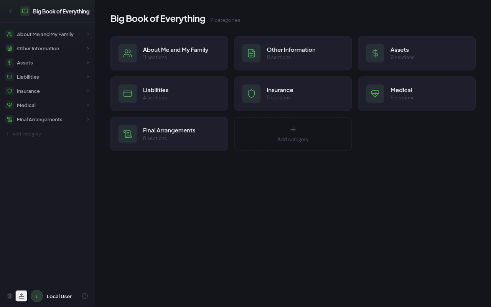
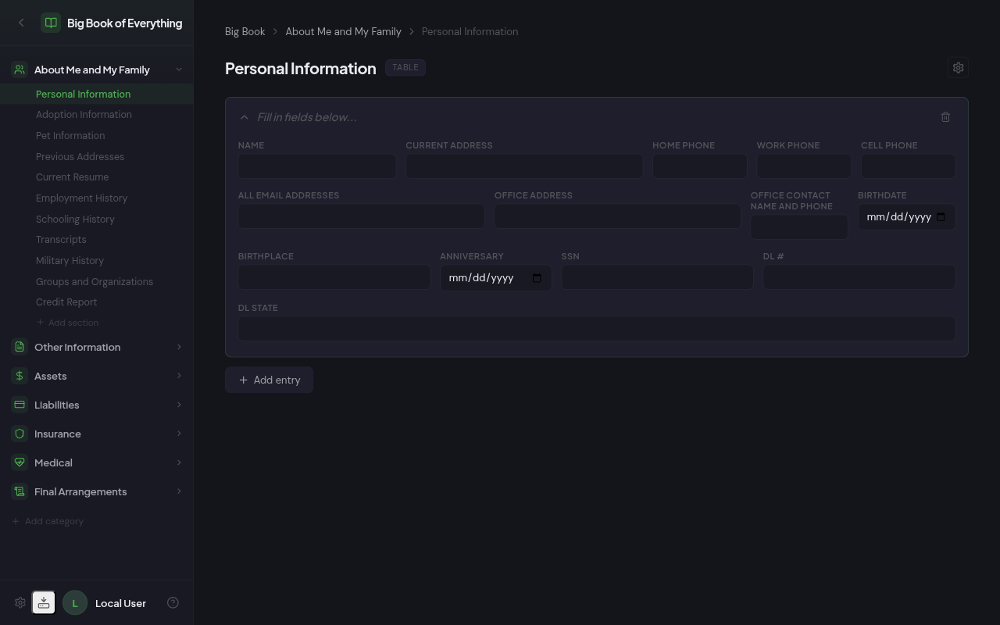
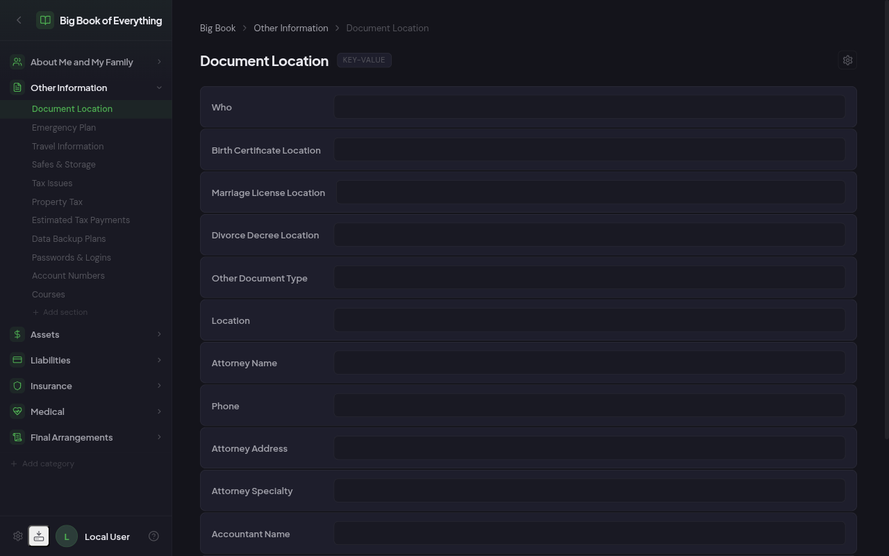
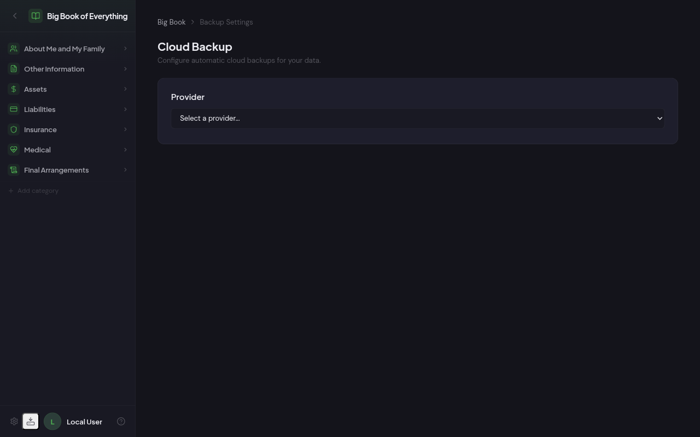

# Big Book of Everything

A self-hosted family information organizer built with SvelteKit. Based on [Erik Dewey's Big Book of Everything](https://www.erikdewey.com/bigbook.htm) — 7 categories, 54 sections, and 469 fields covering personal info, assets, liabilities, insurance, medical records, and final arrangements.

Available as a **web app** (Docker or Node.js) or **desktop app** (.dmg, .AppImage, .exe).

## Screenshots

### Dashboard


### Table Section (Personal Information)


### Key-Value Section (Document Location)


### Cloud Backup Settings


## Features

- **7 Categories, 54 Sections, 469 Fields** — Pre-seeded from the PDF, covers everything from personal info to final arrangements
- **Collapsible Sidebar Navigation** — Browse categories and sections, add custom ones inline
- **Two Section Types** — Key-value pairs for simple data, table layout for multi-record sections
- **Inline Editing** — Add/remove categories, sections, and fields directly from the UI
- **Export & Import** — JSON or SQLite database backup/restore
- **Cloud Backup** — WebDAV, Dropbox, Google Drive, and S3-compatible storage
- **Optional OIDC Auth** — Works with any OIDC provider or runs without auth
- **Dark Theme** — Clean, modern dark UI
- **Desktop Apps** — .dmg (macOS), .AppImage (Linux), portable .exe (Windows)
- **Docker Ready** — Multi-stage Dockerfile included

## Download Desktop App

Download the latest release for your platform:

- **macOS (Apple Silicon):** `Big-Book-of-Everything-*-arm64.dmg`
- **macOS (Intel):** `Big-Book-of-Everything-*-x64.dmg`
- **Linux:** `Big-Book-of-Everything-*.AppImage`
- **Windows (portable):** `Big-Book-of-Everything-*-portable.exe`

See [Releases](https://github.com/testdotphp/big-book-of-everything/releases) for downloads.

## Quick Start

### With Docker

```bash
git clone https://github.com/testdotphp/big-book-of-everything.git
cd big-book-of-everything
docker compose up -d
```

Open http://localhost:3000.

### Without Docker

```bash
git clone https://github.com/testdotphp/big-book-of-everything.git
cd big-book-of-everything
npm install --legacy-peer-deps
npm run build
BOOK_DB_PATH=./data/book.db node build
```

Open http://localhost:3000.

### Development

```bash
npm install --legacy-peer-deps
BOOK_DB_PATH=./data/book.db npm run dev
```

## Configuration

### Environment Variables

| Variable | Required | Description |
|---|---|---|
| `BOOK_DB_PATH` | **Yes** | Path to SQLite DB (e.g., `./data/book.db`) |
| `PORTAL_MODE` | No | Set to `book` for standalone Big Book mode |
| `PORTAL_CONFIG_PATH` | No | Path to portal config JSON for service dashboard mode |
| `ORIGIN` | For HTTPS | Origin URL (e.g., `https://portal.example.com`) |
| `OIDC_ISSUER` | No | OIDC provider issuer URL |
| `OIDC_CLIENT_ID` | No | OIDC client ID |
| `OIDC_CLIENT_SECRET` | No | OIDC client secret |
| `AUTH_SECRET` | With OIDC | Session encryption key (`openssl rand -base64 32`) |

**Auth is optional.** If OIDC variables are not set, the app runs without authentication.

### Customizing the Structure

On first run, the database is seeded with the full book structure from `configs/book-structure.json`. You can customize through the UI:

- Add/remove categories from the sidebar
- Add/remove sections within categories
- Add/remove fields via the gear icon on section pages
- Seeded (PDF-imported) items are protected from accidental deletion

## Cloud Backup

Configure cloud backups from the Backup & Restore menu in the sidebar:

- **WebDAV** — Nextcloud, ownCloud, Synology, any WebDAV server
- **Dropbox** — Using access token
- **Google Drive** — Using OAuth2 client credentials
- **S3-Compatible** — AWS S3, MinIO, Backblaze B2

Supports both JSON and SQLite database format for backups.

## Tech Stack

- [SvelteKit](https://kit.svelte.dev/) with Svelte 5
- [Drizzle ORM](https://orm.drizzle.team/) + SQLite (better-sqlite3)
- [Electron](https://www.electronjs.org/) for desktop builds
- [@auth/sveltekit](https://authjs.dev/getting-started/integrations/sveltekit) for OIDC
- [Lucide](https://lucide.dev/) icons

## License

MIT
